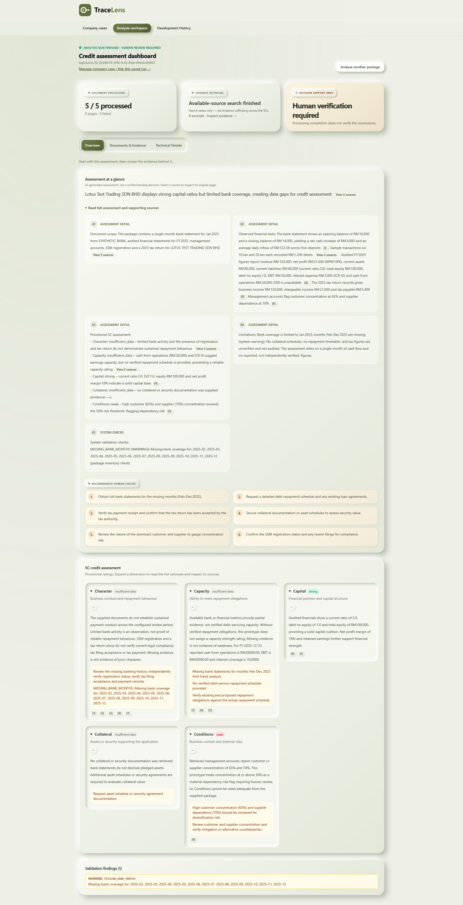
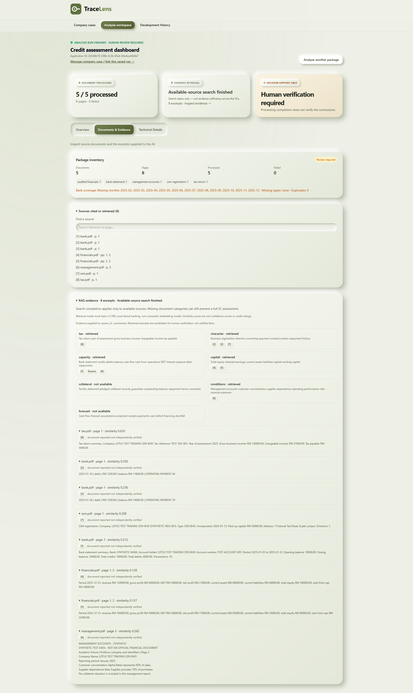
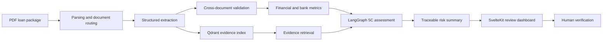

<div align="center">
  

  <h3>Explainable AI for Malaysian SME loan document analysis</h3>

  <p>
    A full-stack decision-support prototype that converts multi-document loan packages
    into traceable financial analysis, evidence-linked 5C assessments, and human-review actions.
  </p>

  <p>
    
    
    
    
    
    
    
  </p>

  <p>
    <a href="https://tracelens-three.vercel.app"><strong>Live Demo</strong></a>
    &nbsp;·&nbsp;
    <a href="https://tracelens-api-h7m2.onrender.com/health"><strong>API Health</strong></a>
  </p>
</div>

> [!IMPORTANT]
> TraceLens is an academic decision-support prototype. It does **not** approve or reject loans, and every generated conclusion remains subject to human verification.

## Product preview

| Explainable assessment | Source and retrieval review |
|---|---|
|  |  |

## What it does

- Processes loan packages containing bank statements, audited financial statements, SSM records, tax returns, management accounts, forecasts, and facility documents.
- Extracts structured financial and business data while retaining page-level source provenance.
- Reconciles bank movements and validates identities, periods, units, and figures across documents.
- Calculates financial ratios and produces a provisional 5C assessment through a LangGraph workflow.
- Links generated claims back to retrieved excerpts and original PDF pages for review.
- Surfaces missing evidence, inconsistencies, and recommended human checks instead of hiding uncertainty.
- Supports Gemini and Groq through a provider abstraction with deterministic fallback behaviour.
- Includes a first-visit product tour and a browser-generated four-PDF synthetic demo package for recruiter-friendly evaluation.

## Architecture



The API is implemented with FastAPI. PostgreSQL, Redis, and Qdrant are provisioned through Docker Compose; the current research prototype keeps some analysis and review history in memory.

## Validated workload

The largest end-to-end scenario currently exercised by the project contains:

| Measure | Result |
|---|---:|
| Documents processed | 32 / 32 |
| PDF pages parsed | 337 |
| Evidence chunks indexed | 1,101 |
| Failed documents | 0 |
| Backend tests | 133 passed, 1 skipped |
| Frontend tests | 20 passed |

The workload uses synthetic documents designed for repeatable academic evaluation. Processing success does not establish creditworthiness or the factual correctness of source documents.

## Technology

| Area | Stack |
|---|---|
| Backend | Python, FastAPI, Pydantic |
| Agent workflow | LangGraph |
| LLM providers | Gemini API, Groq API |
| Document processing | PyMuPDF, pdfplumber, Tesseract-ready OCR pipeline |
| Retrieval | Qdrant with local or Gemini embeddings |
| Data services | PostgreSQL, Redis |
| Frontend | SvelteKit, TypeScript, Tailwind CSS |
| Infrastructure | Docker Compose |
| Quality | pytest, Node test runner, Svelte Check, Ruff |

## Quick start

### Requirements

- Docker Desktop
- A Gemini or Groq API key

### Run with Docker Compose

```bash
cp backend/.env.example backend/.env
# Add GEMINI_API_KEY or GROQ_API_KEY to backend/.env

docker compose up --build
```

Open the following services:

- Dashboard: <http://localhost:5173>
- API documentation: <http://localhost:8000/docs>
- Qdrant dashboard: <http://localhost:6333/dashboard>

See [HOW_TO_RUN.md](HOW_TO_RUN.md) for local development, operational notes, and citation-review guidance.

## Deployment

- Deploy `backend/` to Render and configure the provider, database, Redis, Qdrant, and CORS environment variables there.
- Deploy `frontend/` to Vercel with the project root set to `frontend`.
- Set `VITE_API_URL` in both the Vercel Production and Preview environments to the public Render backend URL. Without it, browser requests fall back to the frontend origin and return the SvelteKit 404 page.

## Tests

```bash
# Backend
cd backend
uv sync
uv run pytest

# Frontend
cd ../frontend
npm install
npm test
npm run check
```

## Repository structure

```text
.
├── backend/
│   ├── app/agent/          # LangGraph workflow, retrieval, fallback reasoning
│   ├── app/api/            # Analysis, evidence, case, and history endpoints
│   ├── app/ingestion/      # Parsing, extraction, provenance, package inventory
│   ├── app/ratios/         # Bank metrics, financial ratios, 5C models
│   ├── app/validation/     # Intra- and cross-document checks
│   ├── scripts/            # Synthetic scenarios and benchmark tooling
│   └── tests/              # Unit, integration, regression, and E2E tests
├── frontend/               # SvelteKit analysis and evidence-review dashboard
├── docs/                   # Design, evaluation, and development documentation
├── data/                   # Local/generated test documents; excluded from Git
└── docker-compose.yml      # Full local stack
```

## Responsible-use boundaries

- Generated ratings are provisional and must be reviewed by a qualified human.
- Similarity scores are retrieval signals, not confidence scores or lending decisions.
- Source documents are reported evidence and are not independently verified by the system.
- The current source-document endpoints are intended for local research use and are not production-hardened.
- Use synthetic or appropriately authorised documents only.

## Documentation

- [Run and review guide](HOW_TO_RUN.md)
- [Realistic package specification](docs/REALISTIC_PACKAGE_SPEC.md)
- [Development history](docs/DEVELOPMENT_HISTORY.md)
- [Project progress](PROGRESS.md)

## Author

Built by **Tran Quang Dat** as a 2026 final-year FinTech project at Asia Pacific University, Malaysia.
